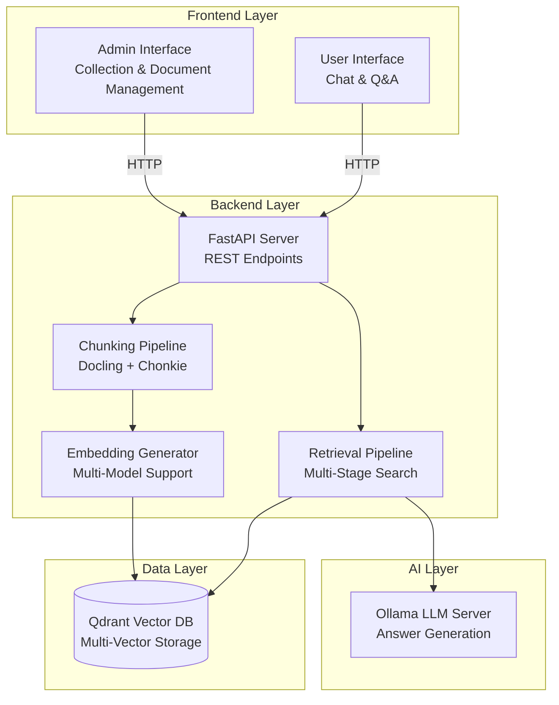
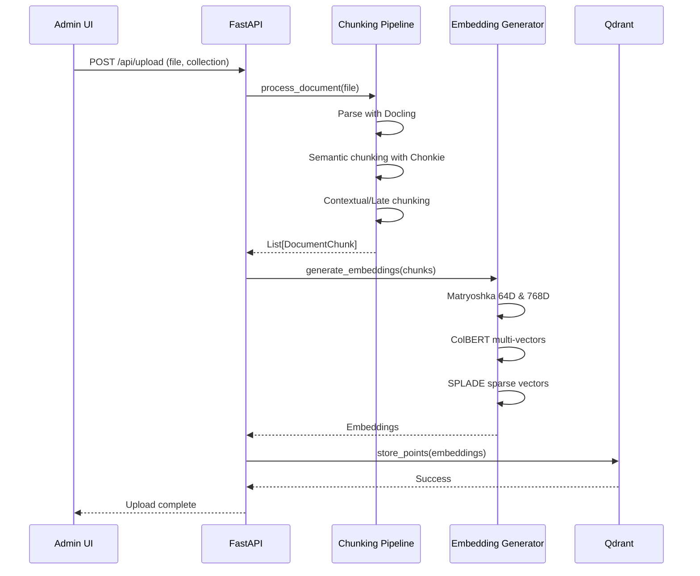
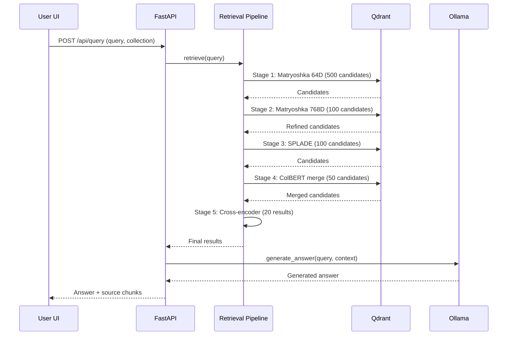

# Design Document: RAG Full-Stack Application

## Overview

This document provides the technical design for a full-stack Retrieval-Augmented Generation (RAG) system. The system enables document ingestion, sophisticated multi-embedding retrieval, and AI-powered question-answering through a modern web interface.

The architecture consists of:

- **Frontend**: React + TypeScript application with admin and user interfaces
- **Backend**: FastAPI server implementing multi-stage retrieval pipelines
- **Vector Database**: Qdrant for storing and querying multiple embedding types
- **LLM Server**: Ollama for natural language generation
- **Embedding Models**: Multiple specialized models for optimal retrieval

The system implements a sophisticated multi-stage retrieval pipeline that combines:

1. Matryoshka embeddings (64D and 768D) for efficient hierarchical search
2. ColBERT embeddings for detailed semantic matching with late interaction
3. SPLADE embeddings for sparse lexical retrieval with term expansion
4. Cross-encoder reranking for final precision optimization

## Architecture

### High-Level System Architecture



### Component Interaction Flow

**Document Upload Flow:**



**Query Flow:**



## Components and Interfaces

### Frontend Components

#### Admin Interface Components

**CollectionManager Component**

```typescript
interface CollectionManagerProps {
  onCollectionChange: (collectionName: string) => void;
}

interface CollectionManagerState {
  collections: string[];
  selectedCollection: string | null;
  loading: boolean;
  error: string | null;
}

class CollectionManager extends React.Component<
  CollectionManagerProps,
  CollectionManagerState
> {
  // Fetches collections from /api/collections
  // Displays dropdown with collection list
  // Handles create/delete operations
}
```

**CollectionCreator Component**

```typescript
interface CollectionCreatorProps {
  onCollectionCreated: (collectionName: string) => void;
}

interface CollectionCreatorState {
  showInput: boolean;
  collectionName: string;
  validationError: string | null;
  creating: boolean;
}

class CollectionCreator extends React.Component<
  CollectionCreatorProps,
  CollectionCreatorState
> {
  // Validates collection name against Qdrant requirements
  // Calls POST /api/collections
  // Displays success/error messages
}
```

**CollectionDeleter Component**

```typescript
interface CollectionDeleterProps {
  selectedCollection: string | null;
  onCollectionDeleted: () => void;
}

interface CollectionDeleterState {
  showConfirmation: boolean;
  deleting: boolean;
}

class CollectionDeleter extends React.Component<
  CollectionDeleterProps,
  CollectionDeleterState
> {
  // Shows confirmation dialog
  // Calls DELETE /api/collections/{name}
  // Handles success/error states
}
```

**FileUploader Component**

```typescript
interface FileUploaderProps {
  selectedCollection: string | null;
  onUploadComplete: (stats: UploadStats) => void;
}

interface FileUploaderState {
  selectedFile: File | null;
  uploading: boolean;
  progress: number;
  error: string | null;
}

interface UploadStats {
  chunksCreated: number;
  processingTime: number;
}

class FileUploader extends React.Component<
  FileUploaderProps,
  FileUploaderState
> {
  // File selection with validation
  // Calls POST /api/upload with multipart/form-data
  // Shows upload progress
  // Displays processing statistics
}
```

#### User Interface Components

**ChatInterface Component**

```typescript
interface ChatInterfaceProps {
  collectionName: string;
}

interface ChatInterfaceState {
  messages: Message[];
  inputValue: string;
  loading: boolean;
  error: string | null;
}

interface Message {
  id: string;
  type: "user" | "assistant";
  content: string;
  timestamp: Date;
  sources?: SourceChunk[];
}

interface SourceChunk {
  id: number;
  text: string;
  score: number;
}

class ChatInterface extends React.Component<
  ChatInterfaceProps,
  ChatInterfaceState
> {
  // Displays message history with timestamps
  // Input field with send button
  // Loading indicator during query processing
  // Auto-scroll to latest message
  // Displays source chunks as expandable references
}
```

### Backend Components

#### API Endpoints

**Collection Management Endpoints**

```python
# GET /api/collections
@app.get("/api/collections")
async def list_collections() -> List[str]:
    """
    Returns list of all collection names in Qdrant.

    Returns:
        List[str]: Collection names

    Raises:
        HTTPException(500): If Qdrant connection fails
    """
    pass

# POST /api/collections
@app.post("/api/collections")
async def create_collection(request: CreateCollectionRequest) -> CreateCollectionResponse:
    """
    Creates a new collection with all required vector configurations.

    Args:
        request: Contains collection_name

    Returns:
        CreateCollectionResponse with success status

    Raises:
        HTTPException(400): If collection name is invalid
        HTTPException(409): If collection already exists
        HTTPException(500): If creation fails
    """
    pass

# DELETE /api/collections/{name}
@app.delete("/api/collections/{name}")
async def delete_collection(name: str) -> DeleteCollectionResponse:
    """
    Deletes a collection from Qdrant.

    Args:
        name: Collection name to delete

    Returns:
        DeleteCollectionResponse with success status

    Raises:
        HTTPException(404): If collection doesn't exist
        HTTPException(500): If deletion fails
    """
    pass
```

**Document Upload Endpoint**

```python
# POST /api/upload
@app.post("/api/upload")
async def upload_document(
    file: UploadFile,
    collection_name: str = Form(...)
) -> UploadResponse:
    """
    Uploads and processes a document into the specified collection.

    Flow:
    1. Validate file format (PDF, Word, Markdown)
    2. Parse document with Docling
    3. Chunk with semantic chunker
    4. Apply contextual or late chunking
    5. Generate all embeddings
    6. Store in Qdrant

    Args:
        file: Uploaded document file
        collection_name: Target collection

    Returns:
        UploadResponse with processing statistics

    Raises:
        HTTPException(400): If file format invalid or collection doesn't exist
        HTTPException(500): If processing fails
    """
    pass
```

**Query Endpoint**

```python
# POST /api/query
@app.post("/api/query")
async def query_documents(request: QueryRequest) -> QueryResponse:
    """
    Executes multi-stage retrieval and generates answer.

    Flow:
    1. Validate query and collection
    2. Execute retrieval pipeline
    3. Generate answer with LLM
    4. Return answer with source chunks

    Args:
        request: Contains query text and collection_name

    Returns:
        QueryResponse with answer and sources

    Raises:
        HTTPException(400): If query or collection invalid
        HTTPException(404): If no relevant documents found
        HTTPException(500): If retrieval or LLM fails
    """
    pass
```

#### Chunking Pipeline

**ChunkingStrategy Class**

```python
class ChunkingStrategy:
    """
    Implements sophisticated document chunking pipeline.

    Pipeline stages:
    1. Parse document with Docling to extract parent chunks by section
    2. Semantic chunking with Chonkie for coherent segments
    3. Optional: Contextual chunking with LLM enrichment
    4. Optional: Late chunking with Jina embeddings
    """

    def __init__(
        self,
        use_contextual: bool = True,
        use_late_chunking: bool = False,
        llm_client: Optional[OpenAI] = None
    ):
        """
        Initialize chunking strategy.

        Args:
            use_contextual: Enable LLM-based contextual enrichment
            use_late_chunking: Enable Jina late chunking
            llm_client: OpenAI-compatible client for contextual chunking
        """
        self.docling_converter = DocumentConverter()
        self.hybrid_chunker = HybridChunker()
        self.semantic_chunker = SemanticChunker()
        self.use_contextual = use_contextual
        self.use_late_chunking = use_late_chunking
        self.llm_client = llm_client

        if use_late_chunking:
            self.jina_model = AutoModel.from_pretrained(
                "jinaai/jina-embeddings-v2-base-en",
                trust_remote_code=True
            )
            self.jina_tokenizer = AutoTokenizer.from_pretrained(
                "jinaai/jina-embeddings-v2-base-en",
                trust_remote_code=True
            )

    def process_document(self, file_path: str) -> List[DocumentChunk]:
        """
        Process document through complete chunking pipeline.

        Args:
            file_path: Path to document file

        Returns:
            List of DocumentChunk objects with metadata
        """
        pass

    def _parse_with_docling(self, file_path: str) -> List[ParentChunk]:
        """Extract parent chunks by section using Docling."""
        pass

    def _semantic_chunk(self, parent_chunks: List[ParentChunk]) -> List[SemanticChunk]:
        """Further segment parent chunks using semantic chunking."""
        pass

    def _contextual_chunk(self, semantic_chunks: List[SemanticChunk]) -> List[ContextualChunk]:
        """Enrich chunks with LLM-generated context."""
        pass

    def _late_chunk(self, parent_chunks: List[ParentChunk]) -> List[LateChunk]:
        """Apply late chunking with Jina embeddings."""
        pass

    def pretty_print(self, chunks: List[DocumentChunk]) -> str:
        """
        Convert chunks back to text format for round-trip testing.

        Args:
            chunks: List of document chunks

        Returns:
            Formatted text representation
        """
        pass
```

#### Embedding Models

**EmbeddingModelManager Class**

```python
class EmbeddingModelManager:
    """
    Manages all embedding models and provides unified interface.

    Supported models:
    - Matryoshka (64D and 768D)
    - ColBERT (128D multi-vectors)
    - SPLADE (sparse vectors)
    - Cross-encoder (reranking)
    """

    def __init__(self, device: str = "auto"):
        """
        Initialize all embedding models.

        Args:
            device: Device for model inference (cuda, mps, cpu, or auto)
        """
        self.device = self._select_device(device)

        # Matryoshka models
        self.matryoshka_768_model = SentenceTransformer(
            "tomaarsen/mpnet-base-nli-matryoshka"
        ).to(self.device)

        self.matryoshka_64_model = SentenceTransformer(
            "tomaarsen/mpnet-base-nli-matryoshka",
            truncate_dim=64
        ).to(self.device)

        # ColBERT model
        self.colbert_model = LateInteractionTextEmbedding("colbert-ir/colbertv2.0")

        # SPLADE model
        self.splade_model = SparseTextEmbedding("prithivida/Splade_PP_en_v1")

        # Cross-encoder for reranking
        self.cross_encoder = CrossEncoder(
            "cross-encoder/ms-marco-MiniLM-L6-v2"
        ).to(self.device)

    def generate_matryoshka_64(self, texts: List[str]) -> np.ndarray:
        """Generate 64-dimensional Matryoshka embeddings."""
        pass

    def generate_matryoshka_768(self, texts: List[str]) -> np.ndarray:
        """Generate 768-dimensional Matryoshka embeddings."""
        pass

    def generate_colbert(self, texts: List[str]) -> List[List[float]]:
        """Generate ColBERT multi-vector embeddings."""
        pass

    def generate_splade(self, texts: List[str]) -> List[SparseVector]:
        """Generate SPLADE sparse embeddings."""
        pass

    def rerank(self, query: str, candidates: List[str]) -> List[float]:
        """Rerank candidates using cross-encoder."""
        pass
```

#### Qdrant Client

**QdrantManager Class**

```python
class QdrantManager:
    """
    Manages Qdrant vector database operations.

    Handles:
    - Collection creation with multi-vector configuration
    - Point storage with multiple embedding types
    - Multi-stage retrieval with prefetch
    """

    def __init__(self, path: str = "./qdrant_db"):
        """
        Initialize Qdrant client.

        Args:
            path: Path to Qdrant database directory
        """
        self.client = QdrantClient(path=path)

    def create_collection(self, collection_name: str) -> None:
        """
        Create collection with multi-vector configuration.

        Configuration:
        - matryoshka_64: 64D dense vectors (COSINE)
        - matryoshka_768: 768D dense vectors (COSINE)
        - colbert: 128D multi-vectors (MAX_SIM comparator)
        - splade: Sparse vectors (IDF modifier)

        Args:
            collection_name: Name of collection to create

        Raises:
            ValueError: If collection already exists
        """
        pass

    def list_collections(self) -> List[str]:
        """List all collection names."""
        pass

    def delete_collection(self, collection_name: str) -> None:
        """Delete a collection."""
        pass

    def store_points(
        self,
        collection_name: str,
        chunks: List[DocumentChunk],
        embeddings: Dict[str, Any]
    ) -> None:
        """
        Store document chunks with all embedding types.

        Args:
            collection_name: Target collection
            chunks: Document chunks with metadata
            embeddings: Dict containing all embedding types
        """
        pass

    def query_with_prefetch(
        self,
        collection_name: str,
        query_embeddings: Dict[str, Any],
        limits: Dict[str, int]
    ) -> List[ScoredPoint]:
        """
        Execute multi-stage retrieval using Qdrant prefetch.

        Stages:
        1. Matryoshka 64D (500 candidates)
        2. Matryoshka 768D refinement (100 candidates)
        3. SPLADE parallel retrieval (100 candidates)
        4. ColBERT merge and refinement (50 candidates)

        Args:
            collection_name: Collection to search
            query_embeddings: All query embedding types
            limits: Limit for each stage

        Returns:
            List of scored points with payloads
        """
        pass
```

#### Retrieval Pipeline

**MultiEmbeddingRetrievalPipeline Class**

```python
class MultiEmbeddingRetrievalPipeline:
    """
    Implements sophisticated multi-stage retrieval pipeline.

    Two implementations:
    1. Optimized with Qdrant prefetch (recommended)
    2. Naive sequential filtering (for comparison)
    """

    def __init__(
        self,
        qdrant_manager: QdrantManager,
        embedding_manager: EmbeddingModelManager,
        use_prefetch: bool = True
    ):
        """
        Initialize retrieval pipeline.

        Args:
            qdrant_manager: Qdrant database manager
            embedding_manager: Embedding model manager
            use_prefetch: Use optimized prefetch implementation
        """
        self.qdrant = qdrant_manager
        self.embeddings = embedding_manager
        self.use_prefetch = use_prefetch

    def retrieve(
        self,
        query: str,
        collection_name: str,
        use_cross_encoder: bool = True
    ) -> List[RetrievalResult]:
        """
        Execute complete retrieval pipeline.

        Args:
            query: User query text
            collection_name: Collection to search
            use_cross_encoder: Apply final cross-encoder reranking

        Returns:
            List of retrieval results with scores and metadata
        """
        pass

    def _hybrid_search_with_prefetch(
        self,
        query: str,
        collection_name: str
    ) -> List[ScoredPoint]:
        """Optimized retrieval using Qdrant prefetch."""
        pass

    def _hybrid_search_naive(
        self,
        query: str,
        collection_name: str
    ) -> List[ScoredPoint]:
        """Naive sequential retrieval for comparison."""
        pass

    def _cross_encoder_rerank(
        self,
        query: str,
        candidates: List[ScoredPoint],
        limit: int = 20
    ) -> List[RetrievalResult]:
        """Final reranking with cross-encoder."""
        pass
```

#### LLM Integration

**LLMClient Class**

```python
class LLMClient:
    """
    Manages interaction with Ollama LLM server.

    Handles:
    - Answer generation from retrieved context
    - Prompt construction
    - Error handling and retries
    """

    def __init__(
        self,
        base_url: str = "http://localhost:11434/v1",
        model: str = "gpt-oss:20b",
        api_key: str = "ollama"
    ):
        """
        Initialize LLM client.

        Args:
            base_url: Ollama server URL
            model: Model name to use
            api_key: API key (default for Ollama)
        """
        self.client = OpenAI(base_url=base_url, api_key=api_key)
        self.model = model

    def generate_answer(
        self,
        query: str,
        context_chunks: List[RetrievalResult]
    ) -> str:
        """
        Generate answer from query and retrieved context.

        Args:
            query: User question
            context_chunks: Retrieved document chunks

        Returns:
            Generated answer text

        Raises:
            LLMConnectionError: If Ollama server unavailable
            LLMGenerationError: If generation fails
        """
        pass

    def _construct_prompt(
        self,
        query: str,
        context_chunks: List[RetrievalResult]
    ) -> str:
        """
        Construct prompt with context and query.

        Format:
        Context:
        [chunk 1]
        [chunk 2]
        ...

        Question: [query]

        Answer:
        """
        pass
```

## Data Models

### Frontend Data Models

```typescript
// Collection models
interface Collection {
  name: string;
}

interface CreateCollectionRequest {
  collection_name: string;
}

interface CreateCollectionResponse {
  success: boolean;
  collection_name: string;
  message?: string;
}

interface DeleteCollectionResponse {
  success: boolean;
  message?: string;
}

// Upload models
interface UploadRequest {
  file: File;
  collection_name: string;
}

interface UploadResponse {
  success: boolean;
  chunks_created: number;
  processing_time: number;
  message?: string;
}

// Query models
interface QueryRequest {
  query: string;
  collection_name: string;
}

interface QueryResponse {
  answer: string;
  sources: SourceChunk[];
  retrieval_time: number;
  generation_time: number;
}

interface SourceChunk {
  id: number;
  text: string;
  score: number;
  metadata: Record<string, any>;
}
```

### Backend Data Models

```python
from pydantic import BaseModel, Field
from typing import List, Optional, Dict, Any
from datetime import datetime

# Collection models
class CreateCollectionRequest(BaseModel):
    collection_name: str = Field(..., min_length=1, max_length=255)

class CreateCollectionResponse(BaseModel):
    success: bool
    collection_name: str
    message: Optional[str] = None

class DeleteCollectionResponse(BaseModel):
    success: bool
    message: Optional[str] = None

# Document chunk models
class DocumentChunk(BaseModel):
    chunk_id: int
    parent_id: int
    text: str
    start_char: int
    end_char: int
    metadata: Dict[str, Any] = {}

class ParentChunk(BaseModel):
    id: int
    text: str
    section_title: Optional[str] = None

class SemanticChunk(BaseModel):
    id: int
    parent_id: int
    text: str
    start_index: int
    end_index: int

class ContextualChunk(BaseModel):
    semantic_chunk_id: int
    parent_id: int
    semantic_chunk: str
    parent_chunk: str
    contextual_chunk: str

class LateChunk(BaseModel):
    semantic_id: int
    parent_id: int
    text: str
    embedding: List[float]
    num_tokens: int

# Upload models
class UploadResponse(BaseModel):
    success: bool
    chunks_created: int
    processing_time: float
    message: Optional[str] = None

# Query models
class QueryRequest(BaseModel):
    query: str = Field(..., min_length=1)
    collection_name: str = Field(..., min_length=1)

class RetrievalResult(BaseModel):
    id: int
    text: str
    score: float
    distance: float
    metadata: Dict[str, Any]

class QueryResponse(BaseModel):
    answer: str
    sources: List[RetrievalResult]
    retrieval_time: float
    generation_time: float

# Embedding models
class SparseVector(BaseModel):
    indices: List[int]
    values: List[float]

class MultiVectorEmbedding(BaseModel):
    vectors: List[List[float]]

class AllEmbeddings(BaseModel):
    matryoshka_64: List[float]
    matryoshka_768: List[float]
    colbert: List[List[float]]
    splade: SparseVector
```

### Qdrant Schema

```python
# Collection configuration
COLLECTION_CONFIG = {
    "vectors_config": {
        "matryoshka_64": {
            "size": 64,
            "distance": "COSINE"
        },
        "matryoshka_768": {
            "size": 768,
            "distance": "COSINE"
        },
        "colbert": {
            "size": 128,
            "distance": "COSINE",
            "multivector_config": {
                "comparator": "MAX_SIM"
            },
            "hnsw_config": {
                "m": 0  # Disable HNSW for reranking
            }
        }
    },
    "sparse_vectors_config": {
        "splade": {
            "modifier": "IDF"
        }
    }
}

# Point payload schema
POINT_PAYLOAD_SCHEMA = {
    "id": int,
    "text": str,
    "chunk_id": int,
    "parent_id": int,
    "start_char": int,
    "end_char": int,
    "document_name": str,
    "upload_timestamp": str,
    "metadata": dict
}
```
