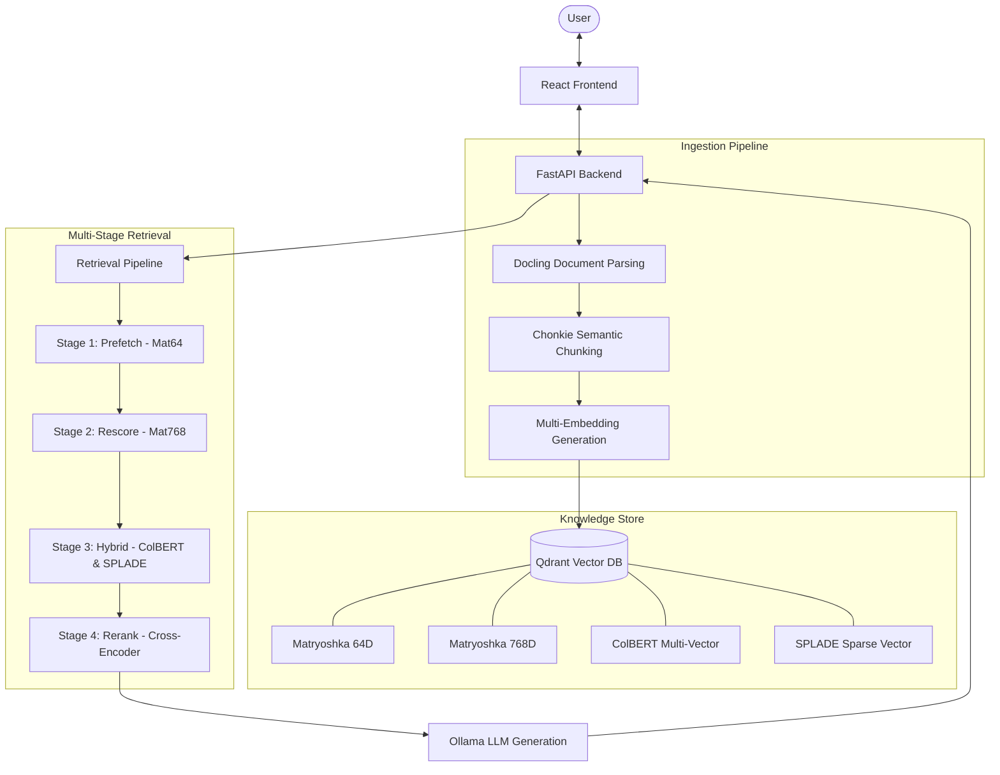

# RAG Full-Stack Application

A high-performance Retrieval-Augmented Generation (RAG) system featuring a sophisticated multi-stage retrieval pipeline. This application integrates state-of-the-art embedding strategies with a modern React frontend and FastAPI backend.

## Architectural Design

The system employs a multi-tiered retrieval strategy to balance speed and accuracy, utilizing Matryoshka embeddings for fast filtering and ColBERT/SPLADE for high-precision reranking.



## Core Features

- **Advanced Retrieval**: Quad-model retrieval pipeline (Matryoshka, ColBERT, SPLADE, Cross-Encoder).
- **Intelligent Chunking**: Semantic document partitioning using Docling and Chonkie.
- **Vibrant UI**: Modern React interface with real-time chat and collection management.
- **Local-First LLM**: Built-in support for Ollama (Llama 3.2, Mistral, etc.).
- **Scalable Storage**: Qdrant vector database with support for both embedded and server modes.

## Tech Stack

| Layer | Technologies |
|-------|--------------|
| **Frontend** | React 18, TypeScript, Vite, Axios |
| **Backend** | FastAPI, Uvicorn, Pydantic |
| **Vector DB** | Qdrant |
| **Embeddings** | SentenceTransformers (Jina, ColBERT, SPLADE) |
| **Processing** | Docling, Chonkie |
| **LLM Inference** | Ollama |

## Quick Start

### 1. Prerequisites
- Python >= 3.10
- Node.js >= 18
- [UV](https://astral.sh/uv/) (Fast Python package manager)
- [Ollama](https://ollama.ai/)

### 2. Implementation & Setup

```bash
# Install backend dependencies
uv sync

# Setup environment
cp .env.template .env

# Install frontend dependencies
cd frontend && npm install && cd ..
```

### 3. Launching

```bash
# Start backend
./start_backend.sh

# Start frontend (in a new terminal)
./start_frontend.sh
```

## Project Structure

- `backend/src/`: Core logic including embedding management and retrieval pipelines.
- `frontend/src/`: React components and API services.
- `tests/`: Comprehensive test suites for backend, frontend, and integration.

## License

MIT
